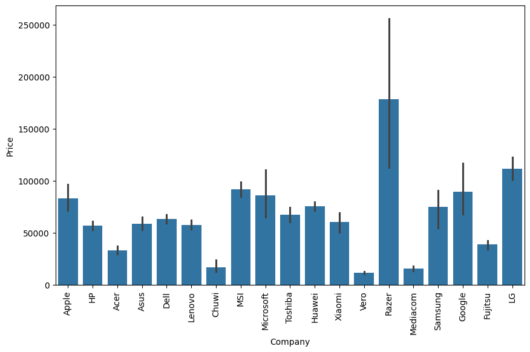
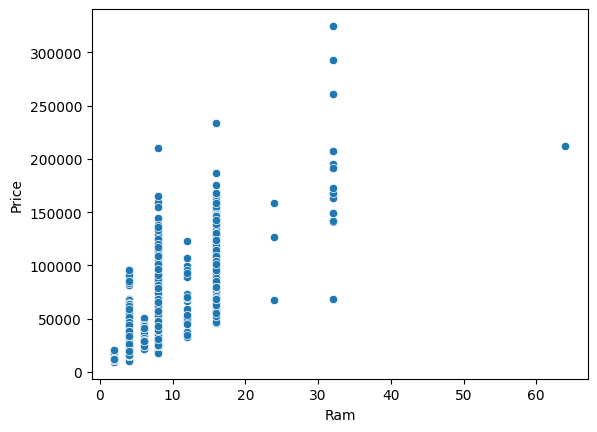
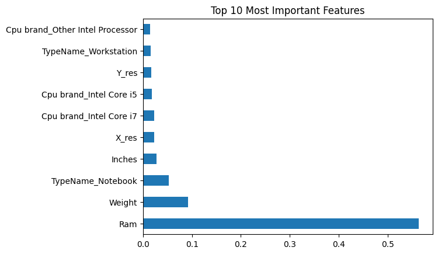
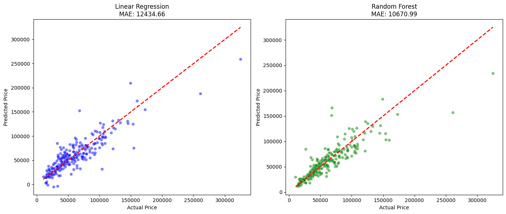

```python
import pandas as pd
url = "https://raw.githubusercontent.com/Raghavagr/Laptop_Price_Prediction/main/laptop_data.csv"
df = pd.read_csv(url)

print(f"Dataset Shape: {df.shape}")
df.head()
```

    Dataset Shape: (1303, 12)
    


<div>
<style scoped>
    .dataframe tbody tr th:only-of-type {
        vertical-align: middle;
    }

    .dataframe tbody tr th {
        vertical-align: top;
    }

    .dataframe thead th {
        text-align: right;
    }
</style>
<table border="1" class="dataframe">
  <thead>
    <tr style="text-align: right;">
      <th></th>
      <th>Unnamed: 0</th>
      <th>Company</th>
      <th>TypeName</th>
      <th>Inches</th>
      <th>ScreenResolution</th>
      <th>Cpu</th>
      <th>Ram</th>
      <th>Memory</th>
      <th>Gpu</th>
      <th>OpSys</th>
      <th>Weight</th>
      <th>Price</th>
    </tr>
  </thead>
  <tbody>
    <tr>
      <th>0</th>
      <td>0</td>
      <td>Apple</td>
      <td>Ultrabook</td>
      <td>13.3</td>
      <td>IPS Panel Retina Display 2560x1600</td>
      <td>Intel Core i5 2.3GHz</td>
      <td>8GB</td>
      <td>128GB SSD</td>
      <td>Intel Iris Plus Graphics 640</td>
      <td>macOS</td>
      <td>1.37kg</td>
      <td>71378.6832</td>
    </tr>
    <tr>
      <th>1</th>
      <td>1</td>
      <td>Apple</td>
      <td>Ultrabook</td>
      <td>13.3</td>
      <td>1440x900</td>
      <td>Intel Core i5 1.8GHz</td>
      <td>8GB</td>
      <td>128GB Flash Storage</td>
      <td>Intel HD Graphics 6000</td>
      <td>macOS</td>
      <td>1.34kg</td>
      <td>47895.5232</td>
    </tr>
    <tr>
      <th>2</th>
      <td>2</td>
      <td>HP</td>
      <td>Notebook</td>
      <td>15.6</td>
      <td>Full HD 1920x1080</td>
      <td>Intel Core i5 7200U 2.5GHz</td>
      <td>8GB</td>
      <td>256GB SSD</td>
      <td>Intel HD Graphics 620</td>
      <td>No OS</td>
      <td>1.86kg</td>
      <td>30636.0000</td>
    </tr>
    <tr>
      <th>3</th>
      <td>3</td>
      <td>Apple</td>
      <td>Ultrabook</td>
      <td>15.4</td>
      <td>IPS Panel Retina Display 2880x1800</td>
      <td>Intel Core i7 2.7GHz</td>
      <td>16GB</td>
      <td>512GB SSD</td>
      <td>AMD Radeon Pro 455</td>
      <td>macOS</td>
      <td>1.83kg</td>
      <td>135195.3360</td>
    </tr>
    <tr>
      <th>4</th>
      <td>4</td>
      <td>Apple</td>
      <td>Ultrabook</td>
      <td>13.3</td>
      <td>IPS Panel Retina Display 2560x1600</td>
      <td>Intel Core i5 3.1GHz</td>
      <td>8GB</td>
      <td>256GB SSD</td>
      <td>Intel Iris Plus Graphics 650</td>
      <td>macOS</td>
      <td>1.37kg</td>
      <td>96095.8080</td>
    </tr>
  </tbody>
</table>
</div>


```python
# Droping unnecessary index column
if 'Unnamed: 0' in df.columns:
    df.drop(columns=['Unnamed: 0'], inplace=True)
    
# removing GB from RAM column
df['Ram'] = df['Ram'].str.replace('GB', '')
df['Ram'] = df['Ram'].astype('int32')

# removing KG from weight column
df['Weight'] = df['Weight'].str.replace('kg', '')
df['Weight'] = df['Weight'].astype('float32')

# verifying
print("--- Data Types After Cleaning ---")
print(df.dtypes[['Ram', 'Weight']])

print("\n--- Cleaned Data Preview ---")
display(df.head())
```

    --- Data Types After Cleaning ---
    Ram         int32
    Weight    float32
    dtype: object
    
    --- Cleaned Data Preview ---
    


<div>
<style scoped>
    .dataframe tbody tr th:only-of-type {
        vertical-align: middle;
    }

    .dataframe tbody tr th {
        vertical-align: top;
    }

    .dataframe thead th {
        text-align: right;
    }
</style>
<table border="1" class="dataframe">
  <thead>
    <tr style="text-align: right;">
      <th></th>
      <th>Company</th>
      <th>TypeName</th>
      <th>Inches</th>
      <th>ScreenResolution</th>
      <th>Cpu</th>
      <th>Ram</th>
      <th>Memory</th>
      <th>Gpu</th>
      <th>OpSys</th>
      <th>Weight</th>
      <th>Price</th>
    </tr>
  </thead>
  <tbody>
    <tr>
      <th>0</th>
      <td>Apple</td>
      <td>Ultrabook</td>
      <td>13.3</td>
      <td>IPS Panel Retina Display 2560x1600</td>
      <td>Intel Core i5 2.3GHz</td>
      <td>8</td>
      <td>128GB SSD</td>
      <td>Intel Iris Plus Graphics 640</td>
      <td>macOS</td>
      <td>1.37</td>
      <td>71378.6832</td>
    </tr>
    <tr>
      <th>1</th>
      <td>Apple</td>
      <td>Ultrabook</td>
      <td>13.3</td>
      <td>1440x900</td>
      <td>Intel Core i5 1.8GHz</td>
      <td>8</td>
      <td>128GB Flash Storage</td>
      <td>Intel HD Graphics 6000</td>
      <td>macOS</td>
      <td>1.34</td>
      <td>47895.5232</td>
    </tr>
    <tr>
      <th>2</th>
      <td>HP</td>
      <td>Notebook</td>
      <td>15.6</td>
      <td>Full HD 1920x1080</td>
      <td>Intel Core i5 7200U 2.5GHz</td>
      <td>8</td>
      <td>256GB SSD</td>
      <td>Intel HD Graphics 620</td>
      <td>No OS</td>
      <td>1.86</td>
      <td>30636.0000</td>
    </tr>
    <tr>
      <th>3</th>
      <td>Apple</td>
      <td>Ultrabook</td>
      <td>15.4</td>
      <td>IPS Panel Retina Display 2880x1800</td>
      <td>Intel Core i7 2.7GHz</td>
      <td>16</td>
      <td>512GB SSD</td>
      <td>AMD Radeon Pro 455</td>
      <td>macOS</td>
      <td>1.83</td>
      <td>135195.3360</td>
    </tr>
    <tr>
      <th>4</th>
      <td>Apple</td>
      <td>Ultrabook</td>
      <td>13.3</td>
      <td>IPS Panel Retina Display 2560x1600</td>
      <td>Intel Core i5 3.1GHz</td>
      <td>8</td>
      <td>256GB SSD</td>
      <td>Intel Iris Plus Graphics 650</td>
      <td>macOS</td>
      <td>1.37</td>
      <td>96095.8080</td>
    </tr>
  </tbody>
</table>
</div>


```python
# checking for nulls
df.isnull().sum()
```


    Company             0
    TypeName            0
    Inches              0
    ScreenResolution    0
    Cpu                 0
    Ram                 0
    Memory              0
    Gpu                 0
    OpSys               0
    Weight              0
    Price               0
    dtype: int64


```python
# creating touchscreen column
df['Touchscreen'] = df['ScreenResolution'].apply(lambda x: 1 if 'Touchscreen' in x else 0)
df.head()
```


<div>
<style scoped>
    .dataframe tbody tr th:only-of-type {
        vertical-align: middle;
    }

    .dataframe tbody tr th {
        vertical-align: top;
    }

    .dataframe thead th {
        text-align: right;
    }
</style>
<table border="1" class="dataframe">
  <thead>
    <tr style="text-align: right;">
      <th></th>
      <th>Company</th>
      <th>TypeName</th>
      <th>Inches</th>
      <th>ScreenResolution</th>
      <th>Cpu</th>
      <th>Ram</th>
      <th>Memory</th>
      <th>Gpu</th>
      <th>OpSys</th>
      <th>Weight</th>
      <th>Price</th>
      <th>Touchscreen</th>
    </tr>
  </thead>
  <tbody>
    <tr>
      <th>0</th>
      <td>Apple</td>
      <td>Ultrabook</td>
      <td>13.3</td>
      <td>IPS Panel Retina Display 2560x1600</td>
      <td>Intel Core i5 2.3GHz</td>
      <td>8</td>
      <td>128GB SSD</td>
      <td>Intel Iris Plus Graphics 640</td>
      <td>macOS</td>
      <td>1.37</td>
      <td>71378.6832</td>
      <td>0</td>
    </tr>
    <tr>
      <th>1</th>
      <td>Apple</td>
      <td>Ultrabook</td>
      <td>13.3</td>
      <td>1440x900</td>
      <td>Intel Core i5 1.8GHz</td>
      <td>8</td>
      <td>128GB Flash Storage</td>
      <td>Intel HD Graphics 6000</td>
      <td>macOS</td>
      <td>1.34</td>
      <td>47895.5232</td>
      <td>0</td>
    </tr>
    <tr>
      <th>2</th>
      <td>HP</td>
      <td>Notebook</td>
      <td>15.6</td>
      <td>Full HD 1920x1080</td>
      <td>Intel Core i5 7200U 2.5GHz</td>
      <td>8</td>
      <td>256GB SSD</td>
      <td>Intel HD Graphics 620</td>
      <td>No OS</td>
      <td>1.86</td>
      <td>30636.0000</td>
      <td>0</td>
    </tr>
    <tr>
      <th>3</th>
      <td>Apple</td>
      <td>Ultrabook</td>
      <td>15.4</td>
      <td>IPS Panel Retina Display 2880x1800</td>
      <td>Intel Core i7 2.7GHz</td>
      <td>16</td>
      <td>512GB SSD</td>
      <td>AMD Radeon Pro 455</td>
      <td>macOS</td>
      <td>1.83</td>
      <td>135195.3360</td>
      <td>0</td>
    </tr>
    <tr>
      <th>4</th>
      <td>Apple</td>
      <td>Ultrabook</td>
      <td>13.3</td>
      <td>IPS Panel Retina Display 2560x1600</td>
      <td>Intel Core i5 3.1GHz</td>
      <td>8</td>
      <td>256GB SSD</td>
      <td>Intel Iris Plus Graphics 650</td>
      <td>macOS</td>
      <td>1.37</td>
      <td>96095.8080</td>
      <td>0</td>
    </tr>
  </tbody>
</table>
</div>


```python
# for extracting resolution
new = df['ScreenResolution'].str.split('x', n=1, expand=True)

df['X_res'] = new[0].str.extract(r'(\d+)$').astype('int')
df['Y_res'] = new[1].astype('int')
df.head()
```


<div>
<style scoped>
    .dataframe tbody tr th:only-of-type {
        vertical-align: middle;
    }

    .dataframe tbody tr th {
        vertical-align: top;
    }

    .dataframe thead th {
        text-align: right;
    }
</style>
<table border="1" class="dataframe">
  <thead>
    <tr style="text-align: right;">
      <th></th>
      <th>Company</th>
      <th>TypeName</th>
      <th>Inches</th>
      <th>ScreenResolution</th>
      <th>Cpu</th>
      <th>Ram</th>
      <th>Memory</th>
      <th>Gpu</th>
      <th>OpSys</th>
      <th>Weight</th>
      <th>Price</th>
      <th>Touchscreen</th>
      <th>X_res</th>
      <th>Y_res</th>
    </tr>
  </thead>
  <tbody>
    <tr>
      <th>0</th>
      <td>Apple</td>
      <td>Ultrabook</td>
      <td>13.3</td>
      <td>IPS Panel Retina Display 2560x1600</td>
      <td>Intel Core i5 2.3GHz</td>
      <td>8</td>
      <td>128GB SSD</td>
      <td>Intel Iris Plus Graphics 640</td>
      <td>macOS</td>
      <td>1.37</td>
      <td>71378.6832</td>
      <td>0</td>
      <td>2560</td>
      <td>1600</td>
    </tr>
    <tr>
      <th>1</th>
      <td>Apple</td>
      <td>Ultrabook</td>
      <td>13.3</td>
      <td>1440x900</td>
      <td>Intel Core i5 1.8GHz</td>
      <td>8</td>
      <td>128GB Flash Storage</td>
      <td>Intel HD Graphics 6000</td>
      <td>macOS</td>
      <td>1.34</td>
      <td>47895.5232</td>
      <td>0</td>
      <td>1440</td>
      <td>900</td>
    </tr>
    <tr>
      <th>2</th>
      <td>HP</td>
      <td>Notebook</td>
      <td>15.6</td>
      <td>Full HD 1920x1080</td>
      <td>Intel Core i5 7200U 2.5GHz</td>
      <td>8</td>
      <td>256GB SSD</td>
      <td>Intel HD Graphics 620</td>
      <td>No OS</td>
      <td>1.86</td>
      <td>30636.0000</td>
      <td>0</td>
      <td>1920</td>
      <td>1080</td>
    </tr>
    <tr>
      <th>3</th>
      <td>Apple</td>
      <td>Ultrabook</td>
      <td>15.4</td>
      <td>IPS Panel Retina Display 2880x1800</td>
      <td>Intel Core i7 2.7GHz</td>
      <td>16</td>
      <td>512GB SSD</td>
      <td>AMD Radeon Pro 455</td>
      <td>macOS</td>
      <td>1.83</td>
      <td>135195.3360</td>
      <td>0</td>
      <td>2880</td>
      <td>1800</td>
    </tr>
    <tr>
      <th>4</th>
      <td>Apple</td>
      <td>Ultrabook</td>
      <td>13.3</td>
      <td>IPS Panel Retina Display 2560x1600</td>
      <td>Intel Core i5 3.1GHz</td>
      <td>8</td>
      <td>256GB SSD</td>
      <td>Intel Iris Plus Graphics 650</td>
      <td>macOS</td>
      <td>1.37</td>
      <td>96095.8080</td>
      <td>0</td>
      <td>2560</td>
      <td>1600</td>
    </tr>
  </tbody>
</table>
</div>


```python
# Check correlation with Price
# Note: This only works for numerical columns
print(df.corr(numeric_only=True)['Price'].sort_values(ascending=False))
df.head()
```

    Price          1.000000
    Ram            0.743007
    X_res          0.556529
    Y_res          0.552809
    Weight         0.210370
    Touchscreen    0.191226
    Inches         0.068197
    Name: Price, dtype: float64
    


<div>
<style scoped>
    .dataframe tbody tr th:only-of-type {
        vertical-align: middle;
    }

    .dataframe tbody tr th {
        vertical-align: top;
    }

    .dataframe thead th {
        text-align: right;
    }
</style>
<table border="1" class="dataframe">
  <thead>
    <tr style="text-align: right;">
      <th></th>
      <th>Company</th>
      <th>TypeName</th>
      <th>Inches</th>
      <th>ScreenResolution</th>
      <th>Cpu</th>
      <th>Ram</th>
      <th>Memory</th>
      <th>Gpu</th>
      <th>OpSys</th>
      <th>Weight</th>
      <th>Price</th>
      <th>Touchscreen</th>
      <th>X_res</th>
      <th>Y_res</th>
    </tr>
  </thead>
  <tbody>
    <tr>
      <th>0</th>
      <td>Apple</td>
      <td>Ultrabook</td>
      <td>13.3</td>
      <td>IPS Panel Retina Display 2560x1600</td>
      <td>Intel Core i5 2.3GHz</td>
      <td>8</td>
      <td>128GB SSD</td>
      <td>Intel Iris Plus Graphics 640</td>
      <td>macOS</td>
      <td>1.37</td>
      <td>71378.6832</td>
      <td>0</td>
      <td>2560</td>
      <td>1600</td>
    </tr>
    <tr>
      <th>1</th>
      <td>Apple</td>
      <td>Ultrabook</td>
      <td>13.3</td>
      <td>1440x900</td>
      <td>Intel Core i5 1.8GHz</td>
      <td>8</td>
      <td>128GB Flash Storage</td>
      <td>Intel HD Graphics 6000</td>
      <td>macOS</td>
      <td>1.34</td>
      <td>47895.5232</td>
      <td>0</td>
      <td>1440</td>
      <td>900</td>
    </tr>
    <tr>
      <th>2</th>
      <td>HP</td>
      <td>Notebook</td>
      <td>15.6</td>
      <td>Full HD 1920x1080</td>
      <td>Intel Core i5 7200U 2.5GHz</td>
      <td>8</td>
      <td>256GB SSD</td>
      <td>Intel HD Graphics 620</td>
      <td>No OS</td>
      <td>1.86</td>
      <td>30636.0000</td>
      <td>0</td>
      <td>1920</td>
      <td>1080</td>
    </tr>
    <tr>
      <th>3</th>
      <td>Apple</td>
      <td>Ultrabook</td>
      <td>15.4</td>
      <td>IPS Panel Retina Display 2880x1800</td>
      <td>Intel Core i7 2.7GHz</td>
      <td>16</td>
      <td>512GB SSD</td>
      <td>AMD Radeon Pro 455</td>
      <td>macOS</td>
      <td>1.83</td>
      <td>135195.3360</td>
      <td>0</td>
      <td>2880</td>
      <td>1800</td>
    </tr>
    <tr>
      <th>4</th>
      <td>Apple</td>
      <td>Ultrabook</td>
      <td>13.3</td>
      <td>IPS Panel Retina Display 2560x1600</td>
      <td>Intel Core i5 3.1GHz</td>
      <td>8</td>
      <td>256GB SSD</td>
      <td>Intel Iris Plus Graphics 650</td>
      <td>macOS</td>
      <td>1.37</td>
      <td>96095.8080</td>
      <td>0</td>
      <td>2560</td>
      <td>1600</td>
    </tr>
  </tbody>
</table>
</div>


```python
import matplotlib.pyplot as plt
import seaborn as sns

# Which brand is the most expensive?
plt.figure(figsize=(10,6))
sns.barplot(x=df['Company'], y=df['Price'])
plt.xticks(rotation='vertical')
plt.show()

# Does RAM increase price linearly?
sns.scatterplot(x=df['Ram'], y=df['Price'])
plt.show()
```


    

    


    

    


```python
def fetch_cpu(text):
    words = text.split()
    # Checking for Intel Core models
    if words[0] == 'Intel' and words[1] == 'Core':
        return ' '.join(words[0:3]) # Returns 'Intel Core i5' etc.
    # Checking for other Intel (Pentium, Celeron)
    elif words[0] == 'Intel':
        return 'Other Intel Processor'
    # Checking for AMD
    else:
        return 'AMD Processor'

# Applying the function to create a new 'Cpu brand' column
df['Cpu brand'] = df['Cpu'].apply(fetch_cpu)

print(df['Cpu brand'].value_counts())
```

    Cpu brand
    Intel Core i7            527
    Intel Core i5            423
    Intel Core i3            136
    Other Intel Processor    135
    AMD Processor             63
    Intel Core M              19
    Name: count, dtype: int64
    


```python
df.drop(columns=['Cpu'], inplace=True)
```


```python
# Selecting categorical columns 
categorical_cols = ['Company', 'TypeName', 'OpSys', 'Cpu brand', 'Gpu']
# One-Hot Encoding using Pandas
df_encoded = pd.get_dummies(df, columns=categorical_cols, drop_first=True)
print(f"New shape after encoding: {df_encoded.shape}")
```

    New shape after encoding: (1303, 154)
    


```python
from sklearn.preprocessing import StandardScaler

#Identifying numerical columns (excluding Price)
num_cols = ['Ram', 'Weight', 'X_res', 'Y_res']
scaler = StandardScaler()
df_encoded[num_cols] = scaler.fit_transform(df_encoded[num_cols])

print("Scaling complete!")
display(df_encoded.head())
```

    Scaling complete!
    


<div>
<style scoped>
    .dataframe tbody tr th:only-of-type {
        vertical-align: middle;
    }

    .dataframe tbody tr th {
        vertical-align: top;
    }

    .dataframe thead th {
        text-align: right;
    }
</style>
<table border="1" class="dataframe">
  <thead>
    <tr style="text-align: right;">
      <th></th>
      <th>Inches</th>
      <th>ScreenResolution</th>
      <th>Ram</th>
      <th>Memory</th>
      <th>Weight</th>
      <th>Price</th>
      <th>Touchscreen</th>
      <th>X_res</th>
      <th>Y_res</th>
      <th>Company_Apple</th>
      <th>...</th>
      <th>Gpu_Nvidia Quadro M1000M</th>
      <th>Gpu_Nvidia Quadro M1200</th>
      <th>Gpu_Nvidia Quadro M2000M</th>
      <th>Gpu_Nvidia Quadro M2200</th>
      <th>Gpu_Nvidia Quadro M2200M</th>
      <th>Gpu_Nvidia Quadro M3000M</th>
      <th>Gpu_Nvidia Quadro M500M</th>
      <th>Gpu_Nvidia Quadro M520M</th>
      <th>Gpu_Nvidia Quadro M620</th>
      <th>Gpu_Nvidia Quadro M620M</th>
    </tr>
  </thead>
  <tbody>
    <tr>
      <th>0</th>
      <td>13.3</td>
      <td>IPS Panel Retina Display 2560x1600</td>
      <td>-0.075195</td>
      <td>128GB SSD</td>
      <td>-1.005283</td>
      <td>71378.6832</td>
      <td>0</td>
      <td>1.345362</td>
      <td>1.860586</td>
      <td>True</td>
      <td>...</td>
      <td>False</td>
      <td>False</td>
      <td>False</td>
      <td>False</td>
      <td>False</td>
      <td>False</td>
      <td>False</td>
      <td>False</td>
      <td>False</td>
      <td>False</td>
    </tr>
    <tr>
      <th>1</th>
      <td>13.3</td>
      <td>1440x900</td>
      <td>-0.075195</td>
      <td>128GB Flash Storage</td>
      <td>-1.050381</td>
      <td>47895.5232</td>
      <td>0</td>
      <td>-0.919776</td>
      <td>-0.600648</td>
      <td>True</td>
      <td>...</td>
      <td>False</td>
      <td>False</td>
      <td>False</td>
      <td>False</td>
      <td>False</td>
      <td>False</td>
      <td>False</td>
      <td>False</td>
      <td>False</td>
      <td>False</td>
    </tr>
    <tr>
      <th>2</th>
      <td>15.6</td>
      <td>Full HD 1920x1080</td>
      <td>-0.075195</td>
      <td>256GB SSD</td>
      <td>-0.268684</td>
      <td>30636.0000</td>
      <td>0</td>
      <td>0.050997</td>
      <td>0.032241</td>
      <td>False</td>
      <td>...</td>
      <td>False</td>
      <td>False</td>
      <td>False</td>
      <td>False</td>
      <td>False</td>
      <td>False</td>
      <td>False</td>
      <td>False</td>
      <td>False</td>
      <td>False</td>
    </tr>
    <tr>
      <th>3</th>
      <td>15.4</td>
      <td>IPS Panel Retina Display 2880x1800</td>
      <td>1.498767</td>
      <td>512GB SSD</td>
      <td>-0.313782</td>
      <td>135195.3360</td>
      <td>0</td>
      <td>1.992544</td>
      <td>2.563795</td>
      <td>True</td>
      <td>...</td>
      <td>False</td>
      <td>False</td>
      <td>False</td>
      <td>False</td>
      <td>False</td>
      <td>False</td>
      <td>False</td>
      <td>False</td>
      <td>False</td>
      <td>False</td>
    </tr>
    <tr>
      <th>4</th>
      <td>13.3</td>
      <td>IPS Panel Retina Display 2560x1600</td>
      <td>-0.075195</td>
      <td>256GB SSD</td>
      <td>-1.005283</td>
      <td>96095.8080</td>
      <td>0</td>
      <td>1.345362</td>
      <td>1.860586</td>
      <td>True</td>
      <td>...</td>
      <td>False</td>
      <td>False</td>
      <td>False</td>
      <td>False</td>
      <td>False</td>
      <td>False</td>
      <td>False</td>
      <td>False</td>
      <td>False</td>
      <td>False</td>
    </tr>
  </tbody>
</table>
<p>5 rows × 154 columns</p>
</div>


```python
df_encoded.info()
```

    <class 'pandas.core.frame.DataFrame'>
    RangeIndex: 1303 entries, 0 to 1302
    Columns: 154 entries, Inches to Gpu_Nvidia Quadro M620M
    dtypes: bool(145), float64(6), int64(1), object(2)
    memory usage: 276.3+ KB
    


```python
cols_to_drop = df_encoded.select_dtypes(include=['object']).columns
df_encoded.drop(columns=cols_to_drop, inplace=True)

print("Remaining types:")
print(df_encoded.dtypes.unique())
```

    Remaining types:
    [dtype('float64') dtype('int64') dtype('bool')]
    


```python
from sklearn.model_selection import train_test_split
from sklearn.linear_model import LinearRegression
from sklearn.metrics import mean_absolute_error, mean_squared_error
import numpy as np

X = df_encoded.drop(columns=['Price'])
y = df_encoded['Price']

# Train-Test Split
X_train, X_test, y_train, y_test = train_test_split(X, y, test_size=0.2, random_state=42)
model = LinearRegression()
model.fit(X_train, y_train)
y_pred = model.predict(X_test)

mae = mean_absolute_error(y_test, y_pred)
mse = mean_squared_error(y_test, y_pred)
rmse = np.sqrt(mse)

print(f"MAE: {mae:.2f}")
print(f"RMSE: {rmse:.2f}")
```

    MAE: 12434.66
    RMSE: 18152.64
    


```python
from sklearn.ensemble import RandomForestRegressor
rf_model = RandomForestRegressor(n_estimators=100, random_state=42)
rf_model.fit(X_train, y_train)
y_pred_rf = rf_model.predict(X_test)

mae_rf = mean_absolute_error(y_test, y_pred_rf)
rmse_rf = np.sqrt(mean_squared_error(y_test, y_pred_rf))

print(f"--- Random Forest Results ---")
print(f"New MAE: {mae_rf:.2f}")
print(f"New RMSE: {rmse_rf:.2f}")
print(f"\nImprovement in MAE: {12434.66 - mae_rf:.2f}")

```

    --- Random Forest Results ---
    New MAE: 10670.99
    New RMSE: 17658.37
    
    Improvement in MAE: 1763.67
    


```python
import pandas as pd
import matplotlib.pyplot as plt

# Getting feature importance from the model
importances = pd.Series(rf_model.feature_importances_, index=X.columns)
importances.nlargest(10).plot(kind='barh')
plt.title('Top 10 Most Important Features')
plt.show()
```


    

    


```python
import matplotlib.pyplot as plt
import seaborn as sns

plt.figure(figsize=(14, 6))

# for Linear Regression
plt.subplot(1, 2, 1)
sns.scatterplot(x=y_test, y=y_pred, color='blue', alpha=0.5)
plt.plot([y_test.min(), y_test.max()], [y_test.min(), y_test.max()], 'r--', lw=2)
plt.title(f'Linear Regression\nMAE: 12434.66')
plt.xlabel('Actual Price')
plt.ylabel('Predicted Price')

# for Random Forest
plt.subplot(1, 2, 2)
sns.scatterplot(x=y_test, y=y_pred_rf, color='green', alpha=0.5)
plt.plot([y_test.min(), y_test.max()], [y_test.min(), y_test.max()], 'r--', lw=2) 
plt.title(f'Random Forest\nMAE: 10670.99')
plt.xlabel('Actual Price')
plt.ylabel('Predicted Price')

plt.tight_layout()
plt.show()
```


    

    

